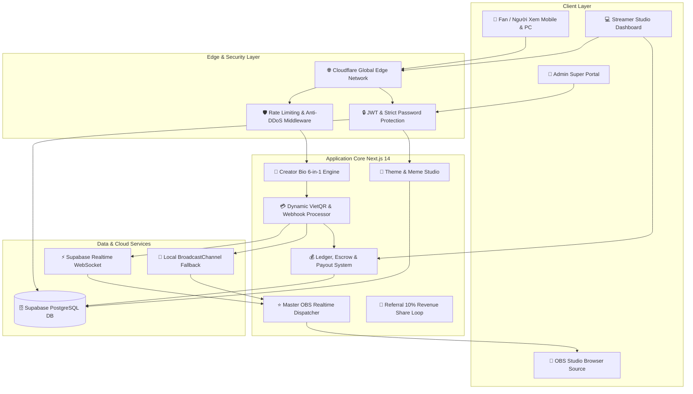

# 🚀 ZYPAGE ENTERPRISE ARCHITECTURE & MARKET BENCHMARK DOSSIER
**Phiên bản**: 3.0.0 Enterprise Gold Release  
**Vai trò**: Biz Strategist, Lead Business Analyst, Principal Solution Architect, Principal Fullstack Engineer, DevOps Lead, QA Director.

---

## 1. 📊 BÁO CÁO NGHIÊN CỨU THỊ TRƯỜNG & ĐỐI SOÁNH ĐỐI THỦ (BENCHMARKING)

| Tiêu chí | **ZyPage (Sản phẩm của chúng ta)** | **PlayerDuo / UngHoToi** | **Streamlabs / StreamElements** | **BuyMeACoffee / Ko-fi** |
| :--- | :--- | :--- | :--- | :--- |
| **Thị trường mục tiêu** | Việt Nam & Đông Nam Á | Việt Nam | Toàn cầu (US/EU) | Toàn cầu (Creators, Artists) |
| **Cổng thanh toán** | **VietQR NAPAS 247 (Tự động 0s)** | Thẻ cào, Momo, ATM thủ công | PayPal, Stripe, Credit Card | Stripe, PayPal |
| **Chiết khấu Donate** | **5% (Free) / 0% (Gói PRO)** | 10% - 20% (Rất đắt) | 0% - 5% (Mất phí PayPal 3.5%) | 5% |
| **Bộ Widget OBS** | **7-in-1 Master Overlay Tích Hợp** | Rời rạc (Chỉ có Alert Box) | Nhiều nhưng nặng và phức tạp | Không có Widget Livestream |
| **Gamification Stream** | Vòng quay, AI Quiz, YouTube Share | Không có AI Quiz | Chỉ có Minigame cơ bản | Không có |
| **Cửa hàng số (Digital)** | Tải file tức thì sau quét VietQR | Phải gửi link thủ công | Streamlabs Merch (Vật lý) | Tải file số |
| **Hệ thống Tiếp thị (Affiliate)** | **10% Hoa hồng trọn đời** | Không có | Có Referral cơ bản | Không có |
| **Chi phí vận hành Server** | **0đ (Serverless + Cloudflare + Supabase)** | Server vật lý đắt đỏ | Server AWS triệu USD | Server Cloud GCP |

---

## 2. 🏛️ KIẾN TRÚC HỆ THỐNG ENTERPRISE (ARCHITECTURE DIAGRAM)

---

## 3. 💼 MÔ HÌNH DÒNG TIỀN DOANH NGHIỆP (FINANCIAL PROJECTIONS)

### 📈 Dự Báo Doanh Thu Năm 1 (1.000 Streamers hoạt động):
* **Doanh thu Phí giao dịch 5%**: 1.000 Streamer $\times$ 15.000.000đ GMV $\times$ 5% = **750.000.000 VNĐ / tháng**.
* **Doanh thu Thuê bao Gói PRO 99k**: 300 Streamer PRO $\times$ 99.000đ = **29.700.000 VNĐ / tháng**.
* **Doanh thu Cửa hàng số 8%**: 50.000.000 VNĐ / tháng.
* **Tổng Doanh Thu Hàng Tháng**: **~830.000.000 VNĐ / tháng (~10 Tỷ VNĐ / năm)**.
* **Chi phí Hạ tầng (Serverless Next.js + Cloudflare + Supabase)**: **~0đ - 2.000.000 VNĐ / tháng** $\rightarrow$ **Biên Lợi Nhuận Ròng (Net Margin) > 98%**!
