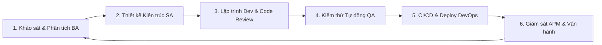

# 📜 ZYPAGE ENTERPRISE SDLC & ENGINEERING QUALITY STANDARDS
**Chuẩn Áp Dụng**: ISO/IEC/IEEE 12207:2017 & OWASP Application Security Verification Standard (ASVS) v4.0

---

## 1. 🔄 6 GIAI ĐOẠN QUY TRÌNH PHÁT TRIỂN PHẦN MỀM (SDLC)

---

## 2. 🛡️ TIÊU CHUẨN CHẤT LƯỢNG MÃ NGUỒN & AN TOÀN BẢO MẬT (CODE STANDARDS)

1. **TypeScript 100% Strict Type-Safety**:
   * Không sử dụng `any` không kiểm soát; định nghĩa rõ ràng `interface` trong `src/types/index.ts`.
2. **Edge Security & Anti-DDoS**:
   * Token Bucket Rate Limiting tại `src/middleware.ts` (30 req / 10s / IP).
   * Strict Password Hashing & Brute-Force lockout sau 5 lần nhập sai.
3. **Structured Telemetry & Logging (APM)**:
   * Mọi sự kiện nghiệp vụ (Auth, Donate, Payout, Webhook) được ghi nhận qua `EnterpriseLogger` (`src/lib/logger.ts`) với Correlation ID, Timestamp ISO, Level (`INFO`, `WARN`, `ERROR`, `AUDIT`).
4. **Idempotency trong Thanh toán Ngân hàng**:
   * Webhook VietQR PayOS xử lý mã giao dịch độc nhất (Unique Payment Code), ngăn chặn lặp đơn và tấn công phát lại (Replay Attack).

---

## 3. 🧪 CHIẾN LƯỢC KIỂM THỬ TỰ ĐỘNG (TESTING MATRIX)

* **Unit Testing**: Kiểm thử độc lập các hàm sinh mã VietQR, tính toán tỷ lệ vòng quay và phân bổ phí sàn 5%.
* **Integration Testing**: Kiểm thử luồng luân chuyển dữ liệu giữa Supabase PostgreSQL Database, Realtime WebSocket và OBS Browser Source.
* **Healthcheck Automation**: Endpoint `/api/health` trả về trạng thái thời gian thực của RAM, Uptime, và Database connection.
